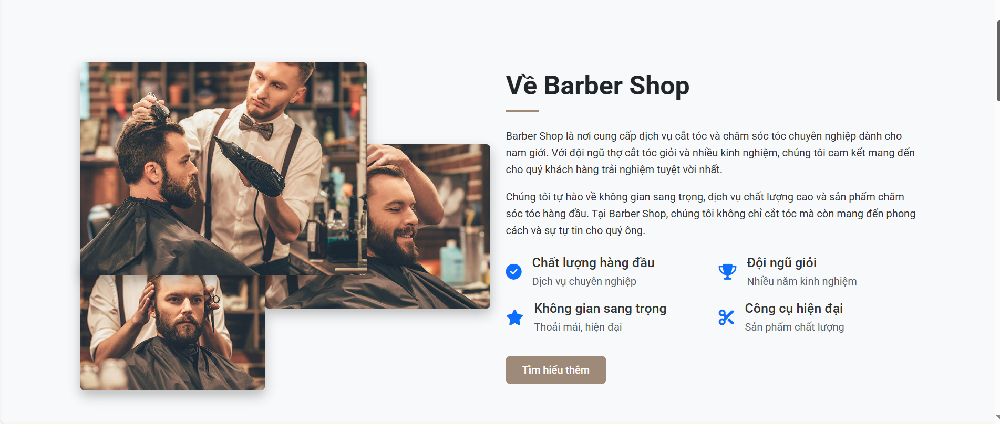
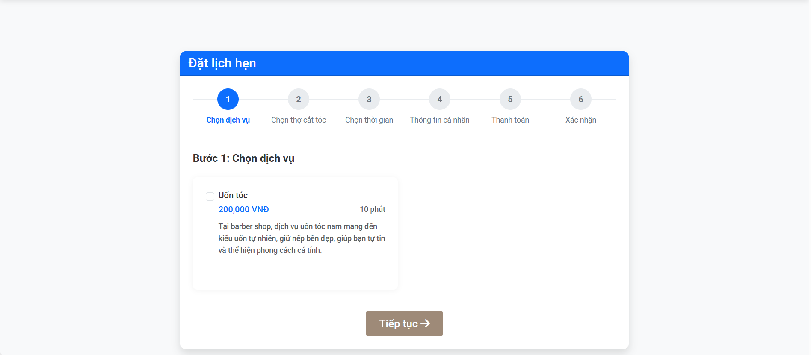
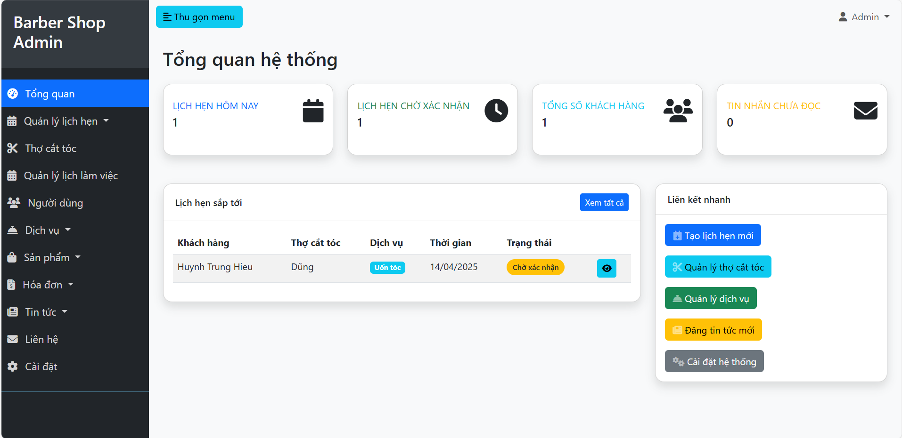
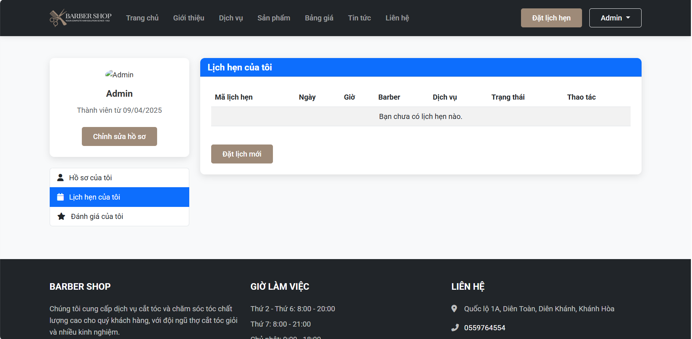

# 💈 Barber Shop - Hệ Thống Quản Lý Tiệm Cắt Tóc


## 📝 Giới Thiệu

**Barber Shop** là một ứng dụng web được phát triển bằng Laravel, giúp quản lý hoạt động của tiệm cắt tóc một cách hiệu quả và chuyên nghiệp. Hệ thống cho phép khách hàng đặt lịch hẹn trực tuyến, quản lý thông tin thợ cắt tóc, dịch vụ, sản phẩm và theo dõi doanh thu.

## ✨ Tính Năng Chính

### 🙋‍♂️ Dành Cho Khách Hàng
- **Đặt lịch hẹn trực tuyến** - Chọn dịch vụ, thợ cắt tóc, ngày giờ và thanh toán
- **Xem lịch sử lịch hẹn** - Theo dõi các lịch hẹn đã đặt, đang chờ hoặc đã hoàn thành
- **Quản lý thông tin cá nhân** - Cập nhật hồ sơ, đổi mật khẩu
- **Đánh giá dịch vụ** - Đánh giá sau khi sử dụng dịch vụ

### 👨‍💼 Dành Cho Admin
- **Tổng quan** - Thống kê doanh thu, lịch hẹn, khách hàng mới
- **Quản lý lịch hẹn** - Xem, chỉnh sửa, xác nhận, hủy lịch hẹn
- **Lịch hẹn theo lịch** - Hiển thị lịch hẹn dạng lịch tháng, tuần, ngày
- **Quản lý thợ cắt tóc** - Thêm, sửa, xóa thông tin thợ
- **Quản lý dịch vụ & sản phẩm** - Thêm, sửa, xóa dịch vụ và sản phẩm
- **Quản lý khách hàng** - Xem thông tin và lịch sử sử dụng dịch vụ của khách hàng
- **Quản lý hóa đơn** - Tạo, in hóa đơn và thống kê doanh thu
- **Quản lý tin tức** - Đăng tin, bài viết, khuyến mãi
- **Cài đặt hệ thống** - Tùy chỉnh thông tin cửa hàng, giờ làm việc

### 💇‍♂️ Dành Cho Thợ Cắt Tóc
- **Lịch làm việc** - Xem lịch hẹn được phân công
- **Thống kê** - Theo dõi số lượng khách hàng, doanh thu

## 🚀 Công Nghệ Sử Dụng

- **Backend**: PHP Laravel, MySQL
- **Frontend**: HTML, CSS, JavaScript, Bootstrap 5
- **Công cụ bổ sung**: FullCalendar.js (lịch), Chart.js (biểu đồ)

## 📸 Hình Ảnh Demo

<div style="display: flex; flex-wrap: wrap; gap: 10px; justify-content: center;">
    
    
    
    
</div>

## 🔧 Hướng Dẫn Cài Đặt

### Yêu Cầu Hệ Thống
- PHP >= 8.1
- MySQL >= 5.7
- Composer
- Node.js & NPM

### Các Bước Cài Đặt

1. **Clone dự án**
   ```bash
   git clone https://github.com/hieuhuynh113/laravel_barber_app.git
   cd laravel_barber_app
   ```

2. **Cài đặt các gói phụ thuộc**
   ```bash
   composer install
   npm install
   ```

3. **Thiết lập môi trường**
   ```bash
   cp .env.example .env
   php artisan key:generate
   ```

4. **Cấu hình cơ sở dữ liệu**
   - Chỉnh sửa file `.env` với thông tin cơ sở dữ liệu của bạn
   ```
   DB_CONNECTION=mysql
   DB_HOST=127.0.0.1
   DB_PORT=3306
   DB_DATABASE=barber_shop
   DB_USERNAME=root
   DB_PASSWORD=
   ```

5. **Chạy migration và seeder**
   ```bash
   php artisan migrate --seed
   ```

6. **Liên kết storage**
   ```bash
   php artisan storage:link
   ```

7. **Khởi động ứng dụng**
   ```bash
   php artisan serve
   npm run dev
   ```

8. **Truy cập ứng dụng**
   - Trang khách hàng: http://localhost:8000
   - Trang quản trị: http://localhost:8000/admin
     - Tài khoản admin: admin@example.com
     - Mật khẩu: password

## 🔒 Tài Khoản Mặc Định

- **Admin**
  - Email: admin@example.com
  - Mật khẩu: password

- **Thợ cắt tóc**
  - Email: barber@example.com
  - Mật khẩu: password

- **Khách hàng**
  - Email: customer@example.com
  - Mật khẩu: password

## 📝 Giấy Phép

Dự án này được phát hành dưới giấy phép MIT.

## 📞 Liên Hệ

Nếu bạn có câu hỏi hoặc góp ý, vui lòng liên hệ qua email: [hieuhuynh113@gmail.com](mailto:hieuhuynh113@gmail.com)

---

<p align="center">Được phát triển với ❤️ bởi Hiếu Huỳnh</p>
