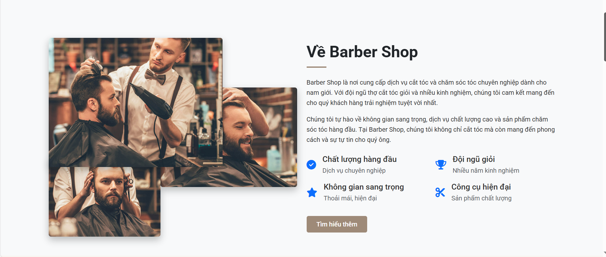
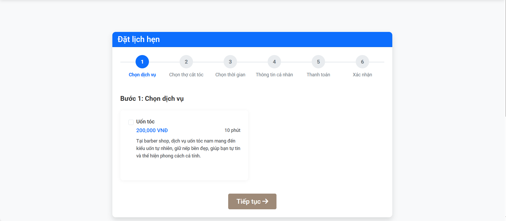
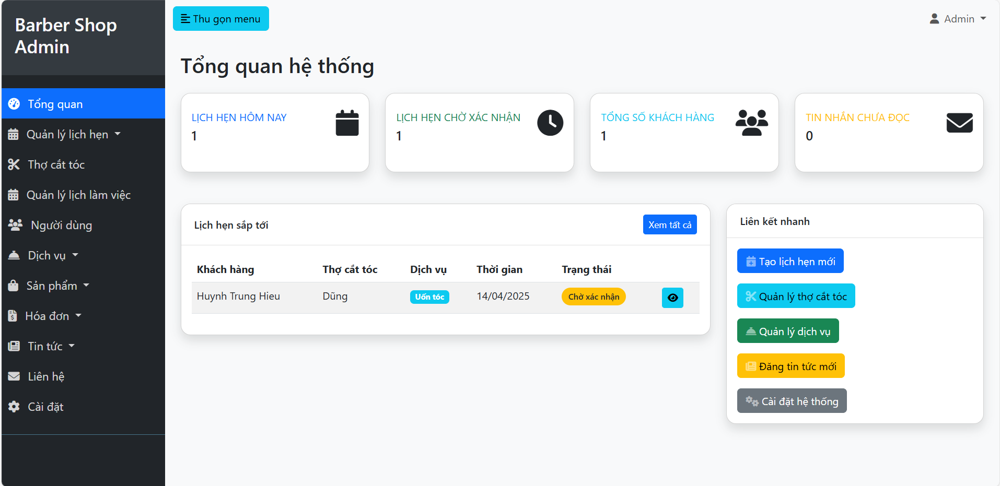
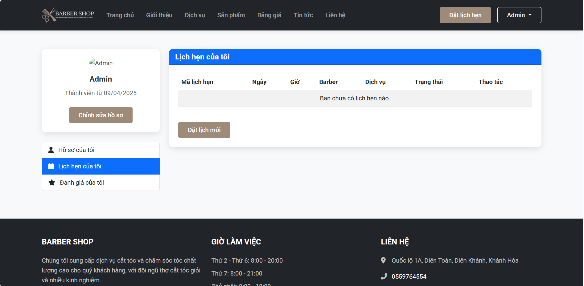

# 💈 Barber Shop - Hệ Thống Quản Lý Tiệm Cắt Tóc Nam


## 📝 Giới Thiệu

**Barber Shop** là một ứng dụng web được phát triển bằng Laravel, giúp quản lý hoạt động của tiệm cắt tóc nam một cách hiệu quả và chuyên nghiệp. Hệ thống cung cấp giải pháp toàn diện cho việc quản lý lịch hẹn, khách hàng, thợ cắt tóc, dịch vụ và doanh thu với giao diện thân thiện và tính năng bảo mật cao.

## ✨ Tính Năng Chi Tiết Theo Vai Trò

### 🙋‍♂️ Dành Cho Khách Hàng (Customer)

#### 🔐 Xác Thực & Bảo Mật

-   **Đăng ký tài khoản với xác thực OTP qua email** - Hệ thống gửi mã OTP 6 số có thời hạn 10 phút
-   **Đăng nhập an toàn** - Xác thực qua email và mật khẩu với yêu cầu bảo mật cao
-   **Quên mật khẩu** - Đặt lại mật khẩu qua email với token bảo mật
-   **Quản lý thông tin cá nhân** - Cập nhật hồ sơ, avatar, thông tin liên hệ

#### 📅 Đặt Lịch Hẹn Trực Tuyến

-   **Chọn dịch vụ** - Xem danh sách dịch vụ với giá cả, thời gian thực hiện chi tiết
-   **Chọn thợ cắt tóc** - Xem thông tin, kinh nghiệm, chuyên môn và đánh giá của thợ
-   **Chọn ngày giờ** - Hệ thống hiển thị khung giờ trống, giới hạn 2 khách/khung giờ
-   **Nhập thông tin liên hệ** - Tên, email, số điện thoại và ghi chú đặc biệt
-   **Thanh toán** - Chuyển khoản ngân hàng với upload biên lai thanh toán
-   **Nhận mã đặt chỗ** - Mã booking duy nhất để theo dõi lịch hẹn

#### 📋 Quản Lý Lịch Hẹn

-   **Xem lịch sử đặt lịch** - Tất cả lịch hẹn với trạng thái: chờ xác nhận, đã xác nhận, hoàn thành, đã hủy
-   **Chi tiết lịch hẹn** - Thông tin dịch vụ, thợ cắt tóc, thời gian, giá cả
-   **Hủy lịch hẹn** - Hủy lịch chưa được xác nhận hoặc chưa thanh toán
-   **Nhận thông báo email** - Xác nhận đặt lịch, thay đổi trạng thái, nhắc nhở

#### ⭐ Đánh Giá & Phản Hồi

-   **Đánh giá dịch vụ** - Cho điểm từ 1-5 sao sau khi hoàn thành dịch vụ
-   **Đánh giá thợ cắt tóc** - Đánh giá kỹ năng và thái độ phục vụ
-   **Viết nhận xét** - Chia sẻ trải nghiệm chi tiết về dịch vụ
-   **Xem đánh giá của mình** - Theo dõi tất cả đánh giá đã đưa ra

#### 📞 Liên Hệ & Hỗ Trợ

-   **Gửi yêu cầu liên hệ** - Form liên hệ với admin về các vấn đề cần hỗ trợ
-   **Nhận phản hồi qua email** - Admin trả lời trực tiếp qua email

### 👨‍💼 Dành Cho Admin (Administrator)

#### 📊 Dashboard & Thống Kê Tổng Quan

-   **Thống kê theo thời gian thực** - Lịch hẹn hôm nay, tuần, tháng, năm
-   **Doanh thu chi tiết** - Theo ngày, tuần, tháng với biểu đồ trực quan
-   **Quản lý khách hàng** - Tổng số khách hàng, khách hàng mới, khách hàng thân thiết
-   **Thống kê đánh giá** - Điểm trung bình, phân bố đánh giá, đánh giá cần chú ý
-   **Tin nhắn chưa đọc** - Số lượng liên hệ chưa được xử lý
-   **Top dịch vụ & thợ cắt tóc** - Xếp hạng theo đánh giá và doanh thu

#### 📅 Quản Lý Lịch Hẹn Toàn Diện

-   **Xem tất cả lịch hẹn** - Lọc theo trạng thái, ngày, thợ cắt tóc, khách hàng
-   **Tạo lịch hẹn mới** - Đặt lịch trực tiếp cho khách hàng qua điện thoại
-   **Cập nhật trạng thái** - Xác nhận, hoàn thành, hủy lịch hẹn
-   **Gửi email tự động** - Thông báo thay đổi trạng thái đến khách hàng
-   **Quản lý khung giờ** - Thiết lập số lượng khách tối đa mỗi khung giờ
-   **Xử lý thanh toán** - Xác nhận biên lai chuyển khoản, cập nhật trạng thái thanh toán

#### 👥 Quản Lý Thợ Cắt Tóc

-   **Thêm thợ mới** - Tạo tài khoản với thông tin cá nhân và chuyên môn
-   **Cập nhật thông tin** - Kinh nghiệm, chuyên môn, avatar, trạng thái hoạt động
-   **Quản lý lịch làm việc** - Thiết lập ngày làm việc, giờ làm việc, ngày nghỉ
-   **Thống kê hiệu suất** - Số lượng khách hàng, doanh thu, đánh giá của từng thợ
-   **Phân công lịch hẹn** - Gán lịch hẹn cho thợ phù hợp

#### 🛍️ Quản Lý Dịch Vụ & Sản Phẩm

-   **Danh mục dịch vụ** - Tạo, sửa, xóa các danh mục dịch vụ
-   **Chi tiết dịch vụ** - Tên, mô tả, giá cả, thời gian thực hiện, hình ảnh
-   **Quản lý sản phẩm** - Sản phẩm chăm sóc tóc, gel, dầu gội với giá bán
-   **Cập nhật giá cả** - Thay đổi giá theo thời gian, khuyến mãi

#### 👤 Quản Lý Khách Hàng

-   **Danh sách khách hàng** - Thông tin cá nhân, ngày đăng ký, trạng thái
-   **Lịch sử sử dụng** - Tất cả lịch hẹn, dịch vụ đã sử dụng, tổng chi tiêu
-   **Thống kê đánh giá** - Đánh giá của khách hàng, phân tích hành vi
-   **Quản lý tài khoản** - Kích hoạt/vô hiệu hóa tài khoản khách hàng

#### 💰 Quản Lý Hóa Đơn & Doanh Thu

-   **Tạo hóa đơn** - Tự động tạo hóa đơn từ lịch hẹn hoàn thành
-   **In hóa đơn** - Xuất hóa đơn PDF với thông tin chi tiết
-   **Thống kê doanh thu** - Báo cáo theo ngày, tuần, tháng, năm
-   **Phân tích lợi nhuận** - Doanh thu theo dịch vụ, thợ cắt tóc
-   **Quản lý thanh toán** - Theo dõi trạng thái thanh toán, xử lý biên lai

#### 📰 Quản Lý Tin Tức & Khuyến Mãi

-   **Đăng tin tức** - Tạo bài viết về dịch vụ mới, khuyến mãi
-   **Quản lý nội dung** - Chỉnh sửa, xóa, ẩn/hiện bài viết
-   **Tin nổi bật** - Đánh dấu tin quan trọng hiển thị trên trang chủ
-   **SEO tối ưu** - Tiêu đề, mô tả, từ khóa cho bài viết

#### ⭐ Quản Lý Đánh Giá & Phản Hồi

-   **Xem tất cả đánh giá** - Lọc theo điểm số, dịch vụ, thợ cắt tóc
-   **Phản hồi đánh giá** - Trả lời đánh giá của khách hàng
-   **Ẩn/hiện đánh giá** - Kiểm duyệt đánh giá không phù hợp
-   **Thống kê đánh giá** - Phân tích xu hướng, điểm trung bình
-   **Cảnh báo đánh giá thấp** - Thông báo đánh giá 1-2 sao cần xử lý

#### 📧 Quản Lý Liên Hệ & Hỗ Trợ

-   **Xem tin nhắn liên hệ** - Tất cả yêu cầu từ khách hàng
-   **Phản hồi qua email** - Trả lời trực tiếp qua email khách hàng
-   **Đánh dấu đã đọc** - Quản lý trạng thái xử lý tin nhắn
-   **Phân loại tin nhắn** - Theo chủ đề: khiếu nại, góp ý, hỗ trợ

### 💇‍♂️ Dành Cho Thợ Cắt Tóc (Barber)

#### 📊 Dashboard Cá Nhân

-   **Thống kê hôm nay** - Số lịch hẹn, khách hàng đã phục vụ
-   **Lịch hẹn sắp tới** - 5 lịch hẹn gần nhất đã được xác nhận
-   **Tổng thống kê** - Tổng lịch hẹn, lịch hẹn hoàn thành
-   **Thông báo** - Lịch hẹn mới, thay đổi lịch, đánh giá từ khách hàng

#### 📅 Quản Lý Lịch Làm Việc

-   **Xem lịch hẹn được phân công** - Theo ngày, tuần với thông tin chi tiết
-   **Chi tiết khách hàng** - Tên, số điện thoại, dịch vụ yêu cầu, ghi chú
-   **Xác nhận lịch hẹn** - Xác nhận có thể phục vụ khách hàng
-   **Gửi email tự động** - Thông báo xác nhận đến khách hàng
-   **Lịch làm việc cá nhân** - Xem ca làm việc, ngày nghỉ

#### 📈 Thống Kê & Báo Cáo Cá Nhân

-   **Doanh thu cá nhân** - Theo ngày, tuần, tháng
-   **Số lượng khách hàng** - Khách hàng mới, khách hàng quay lại
-   **Đánh giá nhận được** - Điểm trung bình, nhận xét từ khách hàng
-   **Hiệu suất làm việc** - Tỷ lệ hoàn thành lịch hẹn, thời gian phục vụ

#### 👤 Quản Lý Hồ Sơ Cá Nhân

-   **Cập nhật thông tin** - Kinh nghiệm, chuyên môn, mô tả bản thân
-   **Thay đổi avatar** - Upload ảnh đại diện chuyên nghiệp
-   **Cập nhật lịch làm việc** - Đăng ký ca làm việc, xin nghỉ phép

## 🚀 Công Nghệ Sử Dụng

-   **Backend**: PHP Laravel, MySQL
-   **Frontend**: HTML, CSS, JavaScript, Bootstrap 5
-   **Công cụ bổ sung**: FullCalendar.js (lịch), Chart.js (biểu đồ)

## 📸 Hình Ảnh Demo

<div style="display: flex; flex-wrap: wrap; gap: 10px; justify-content: center;">
    
    
    
    
</div>

## 🔧 Hướng Dẫn Cài Đặt

### Yêu Cầu Hệ Thống

-   PHP >= 8.2
-   MySQL >= 5.7
-   Composer
-   Node.js & NPM

### Các Bước Cài Đặt

1. **Clone dự án**

    ```bash
    git clone https://github.com/hieuhuynh113/laravel_barber_app.git
    cd laravel_barber_app
    ```

2. **Cài đặt các gói phụ thuộc**

    ```bash
    composer install
    npm install
    ```

3. **Thiết lập môi trường**

    ```bash
    cp .env.example .env
    php artisan key:generate
    ```

4. **Cấu hình cơ sở dữ liệu và email**

    - Chỉnh sửa file `.env` với thông tin cơ sở dữ liệu của bạn

    ```
    DB_CONNECTION=mysql
    DB_HOST=127.0.0.1
    DB_PORT=3306
    DB_DATABASE=laravel_barber_app
    DB_USERNAME=root
    DB_PASSWORD=
    ```

    - Cấu hình email cho chức năng quên mật khẩu và xác thực email

    ```
    MAIL_MAILER=smtp
    MAIL_HOST=smtp.gmail.com
    MAIL_PORT=587
    MAIL_USERNAME=your-email@gmail.com
    MAIL_PASSWORD=your-app-password
    MAIL_ENCRYPTION=tls
    MAIL_FROM_ADDRESS=your-email@gmail.com
    MAIL_FROM_NAME="Barber Shop"
    ```

5. **Chạy migration và seeder**

    ```bash
    php artisan migrate --seed
    ```

    Hoặc sử dụng file SQL đã có sẵn:

    - Tạo database mới tên `laravel_barber_app`
    - Import file `barber_shop_database.sql` vào database

6. **Liên kết storage**

    ```bash
    php artisan storage:link
    ```

7. **Khởi động ứng dụng**

    ```bash
    php artisan serve
    npm run dev
    ```

8. **Truy cập ứng dụng**
    - Trang khách hàng: http://localhost:8000
    - Trang quản trị: http://localhost:8000/admin
    - Trang thợ cắt tóc: http://localhost:8000/barber

## 🔒 Tài Khoản Mặc Định

-   **Admin**

    -   Email: hieu.ht.63cntt@ntu.edu.vn
    -   Mật khẩu: password
    -   Truy cập: http://localhost:8000/admin

-   **Thợ cắt tóc**

    -   Cần được tạo bởi Admin
    -   Truy cập: http://localhost:8000/barber

-   **Khách hàng**
    -   Đăng ký tại: http://localhost:8000/register
    -   Xác thực qua OTP email
    -   Truy cập: http://localhost:8000

## 💡 Tính Năng Nổi Bật

### 🔐 Bảo Mật & Xác Thực

-   **Xác thực email bằng OTP**: Hệ thống gửi mã OTP 6 số qua email với thời hạn 10 phút
-   **Phân quyền người dùng**: 3 vai trò rõ ràng (Admin, Barber, Customer) với middleware bảo mật
-   **Mật khẩu mạnh**: Yêu cầu ít nhất 8 ký tự, bao gồm chữ hoa, chữ thường, số và ký tự đặc biệt
-   **Quên mật khẩu**: Đặt lại mật khẩu an toàn qua email với token có thời hạn
-   **Session management**: Quản lý phiên đăng nhập an toàn với chuyển hướng thông minh

### 📅 Quản Lý Lịch Hẹn Thông Minh

-   **Đặt lịch theo khung giờ**: Khách hàng chọn khung giờ cụ thể (1 giờ/khung) thay vì khoảng thời gian
-   **Giới hạn số lượng**: Mỗi khung giờ tối đa 2 khách hàng (có thể tùy chỉnh theo thợ cắt tóc)
-   **Time slot management**: Hệ thống tự động quản lý khung giờ trống/đầy
-   **Lịch làm việc linh hoạt**: Admin thiết lập lịch làm việc riêng cho từng thợ cắt tóc
-   **Xác nhận 2 bước**: Khách đặt lịch → Admin xác nhận → Thợ cắt tóc xác nhận

### 💳 Thanh Toán & Hóa Đơn

-   **Chuyển khoản ngân hàng**: Upload biên lai thanh toán với xác thực từ admin
-   **Quản lý hóa đơn**: Tự động tạo hóa đơn từ lịch hẹn hoàn thành
-   **Thống kê doanh thu**: Báo cáo chi tiết theo ngày/tuần/tháng/năm
-   **Xuất PDF**: In hóa đơn chuyên nghiệp với thông tin đầy đủ

### ⭐ Đánh Giá & Phản Hồi

-   **Hệ thống đánh giá**: Khách hàng đánh giá dịch vụ và thợ cắt tóc (1-5 sao)
-   **Phản hồi admin**: Admin có thể trả lời đánh giá của khách hàng
-   **Thống kê đánh giá**: Phân tích xu hướng, top dịch vụ/thợ cắt tóc
-   **Cảnh báo đánh giá thấp**: Thông báo tự động khi có đánh giá 1-2 sao

### 📧 Hệ Thống Email & Thông Báo

-   **Email tự động**: Xác nhận đặt lịch, thay đổi trạng thái, thanh toán
-   **Thông báo realtime**: Laravel Notifications cho admin và thợ cắt tóc
-   **Template email**: Giao diện email chuyên nghiệp với branding
-   **Liên hệ & hỗ trợ**: Form liên hệ với phản hồi qua email

## 🗄️ Cấu Trúc Database

### Bảng Chính

-   **users**: Quản lý tài khoản (admin, barber, customer)
-   **barbers**: Thông tin chi tiết thợ cắt tóc
-   **barber_schedules**: Lịch làm việc của thợ cắt tóc
-   **appointments**: Lịch hẹn với đầy đủ thông tin
-   **time_slots**: Quản lý khung giờ và số lượng đặt chỗ
-   **services**: Dịch vụ cắt tóc với giá cả
-   **products**: Sản phẩm chăm sóc tóc
-   **categories**: Danh mục dịch vụ
-   **invoices**: Hóa đơn và thanh toán
-   **reviews**: Đánh giá từ khách hàng
-   **contacts**: Tin nhắn liên hệ
-   **news**: Tin tức và khuyến mãi
-   **email_verifications**: Xác thực OTP email
-   **payment_receipts**: Biên lai thanh toán
-   **notifications**: Thông báo hệ thống

### Quan Hệ Database

-   User → Barber (1:1)
-   User → Appointments (1:n)
-   Barber → Appointments (1:n)
-   Barber → BarberSchedules (1:n)
-   Appointment → Services (n:n)
-   User → Reviews (1:n)
-   Service → Reviews (1:n)

## ⚠️ Lưu Ý Quan Trọng

### Bảo Mật

-   Đảm bảo cấu hình SMTP đúng để gửi email OTP
-   Thay đổi APP_KEY và các thông tin nhạy cảm trong .env
-   Sử dụng HTTPS trong môi trường production
-   Backup database định kỳ

### Hiệu Suất

-   Sử dụng cache cho các truy vấn thường xuyên
-   Optimize hình ảnh trước khi upload
-   Thiết lập index database phù hợp
-   Sử dụng queue cho email và notification

### Triển Khai

-   Kiểm tra PHP version và extensions
-   Cấu hình web server (Apache/Nginx)
-   Thiết lập cron job cho scheduled tasks
-   Monitor logs và error handling

## 📝 Giấy Phép

Dự án này được phát hành dưới giấy phép MIT.

## 📞 Liên Hệ

Nếu bạn có câu hỏi hoặc góp ý, vui lòng liên hệ qua email: [hieu0559764554@gmail.com](mailto:hieu0559764554@gmail.com)

---

<p align="center">Được phát triển với ❤️ bởi Hiếu Huỳnh</p>
